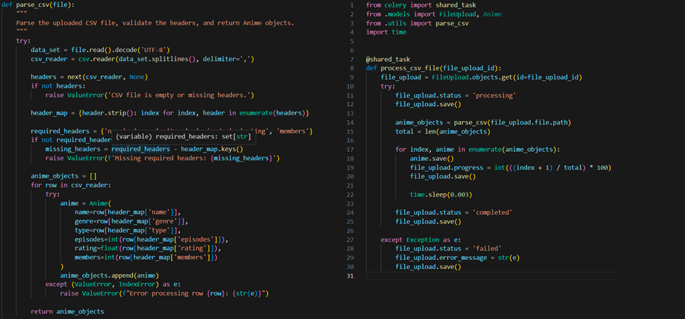
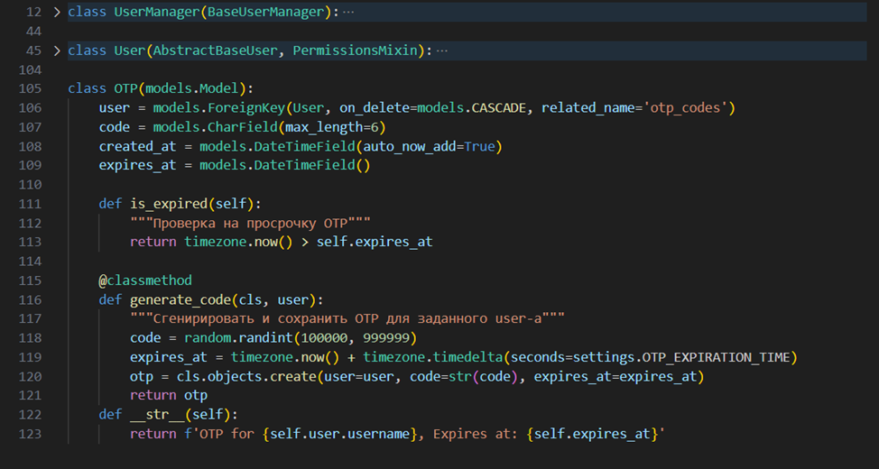
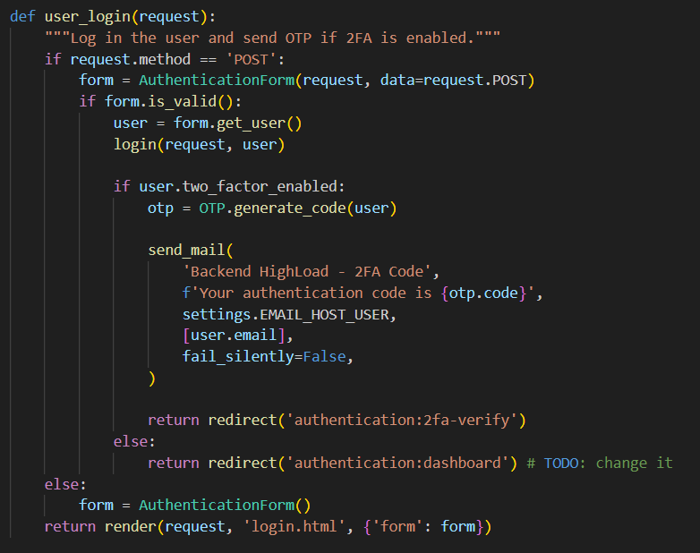
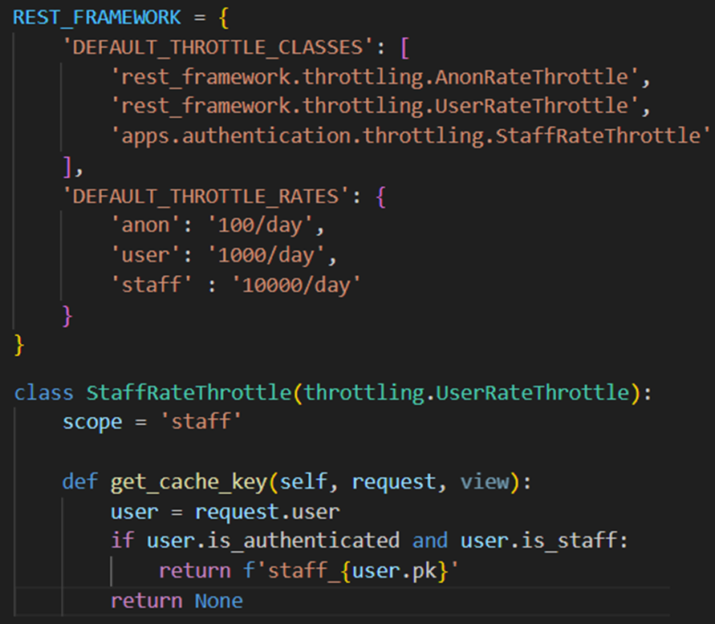

## Project Overview

This repository contains a Django backend application designed for managing anime data. Users can upload `.csv` files, which are processed asynchronously using Celery. The backend provides CRUD operations on the processed data and features robust authentication mechanisms, including two-factor authentication (2FA) using email OTPs.

### Key Features

- **Asynchronous Task Handling**:
  - Tasks like email notifications and file processing run in the background.
    
  - Utilizes Celery with Redis as the message broker.
- **Custom Authentication**:
  - Email-based OTP for two-factor authentication.
    
    
  - Custom user model with enhanced security features.
- **Caching**:
  - Redis caching for frequently accessed data to improve performance.
- **Throttling**:
  - Custom throttling rates to prevent abuse and ensure stability under high load.
    

### Technologies Used

- **Celery**: For asynchronous task handling.
- **Redis**: Used as a caching backend and message broker.
- **django-otp**: For implementing OTP-based 2FA.

### Endpoints

- `/uplaod/`: Upload .csv file to system
- `/status/<file_id>`: Retrieve the status of a file upload and processing.

- `/anime/`: CRUD by generics of DRF
- `/anime/<anime_id>`: CRUD by generics of DRF

### Usage

- **CSV Upload**: Navigate to the appropriate endpoint and upload a CSV file to process anime data.
- **2FA Login**: On login, users will receive a one-time password (OTP) via email for verification.

### Conclusion

This project highlights the integration of modern Django tools for creating a high-load backend environment. By leveraging Celery and Redis for asynchronous task management and caching, the application ensures performance and responsiveness even under heavy load. Security is enhanced with custom authentication and 2FA, making it a robust solution for managing anime data efficiently.
